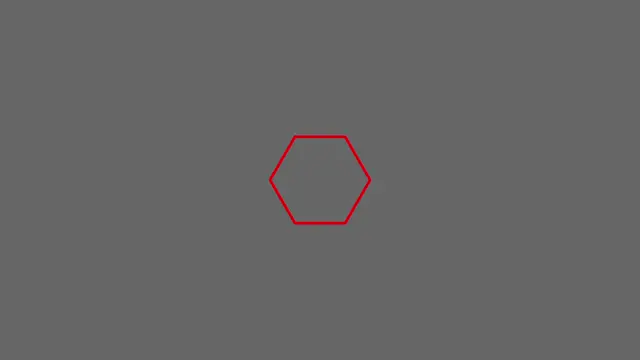

# Bevy Canvas API prototype

> ⚠️ **NOTE.** _This crate is now deprecated. Use another plugin, like `bevy_prototype_lyon` instead._

An unofficial immediate mode 2D drawing API for [Bevy game engine](https://github.com/bevyengine/bevy).

Check the documentation or the examples to know how to use this API.

## Goal
Developing a proof of concept to help Bevy contributors and give them a reference project to develop a full-featured official Canvas API for Bevy. Another goal is to provide the community a Bevy plugin to draw shapes, which will feed back into the primary goal.

## How to contribute
Currently (May 2021) I'm not in the mood of adding new features to the library since I want to focus on other areas of Bevy. However, issues and pull requests are welcome. Here are some guidelines:

- Write commit message titles, PR titles and issue titles in the imperative form.
- Avoid overhauling pull requests without prior discussion. Examples are: adding complexity (deps, features) just for your use case or defeating the simple and extensible API philosophy. If you really think that something important needs to be done, **open an issue** and explain why a certain change is beneficial to the project and the community.

## Is this going to replace `bevy_prototype_lyon`?

Probably not. While the goal is similar, there are some important differences:

- Immediate mode graphics API. In `bevy_canvas`, shapes must be drawn every frame because there is no entity that stores the info about the shape. You just issue drawing commands. In `bevy_prototype_lyon` instead, you spawn an entity that emits draw commands by its own.
- Shapes are rendered after the main pass. This can be an important limitation for your application if, for example, you want to draw a sprite on top of a shape, since the shape will always be rendered *after* the sprite. If that's the problem, use `bevy_prototype_lyon`, at least for now.

## Known issues
- MSAA not working
- WebGL support absent

Feel free to open an issue and/or a PR to fix.

## Bevy support table

|bevy|bevy_canvas|
|---|---|
|0.5|0.1|
